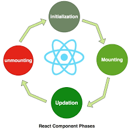
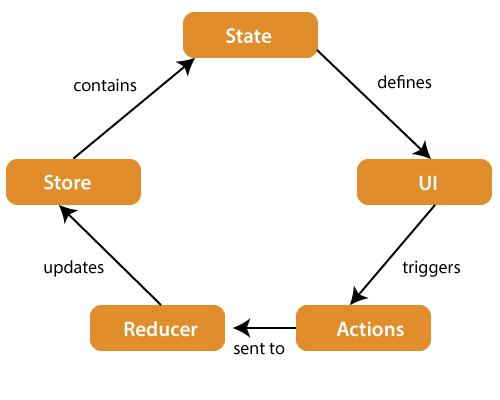
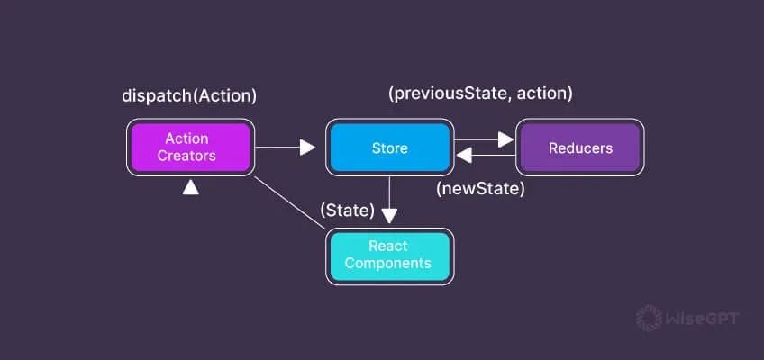
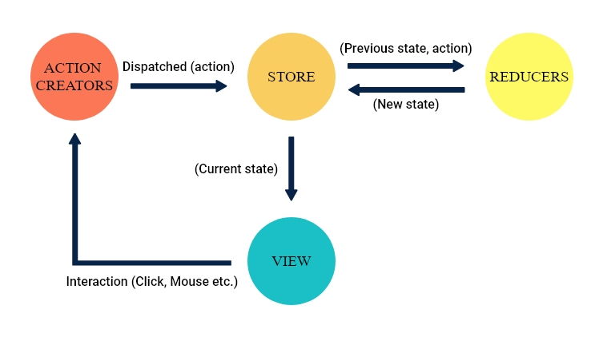

# what is redux ? 
  1. redux is an library of react js 
  2. redux provides life cycle 
  3. redux is used to manage state managements in react js 
  4. redux structures is bit complex 
  5. redux is used to handel complex application inside of react js 
  6. redux is used to stored data and manage it via state managements 
  7. redux is used to stored or update data via state managements 
  8. redux is an library of react js so we can install first redux inside of react js ...

      **how to install redux in reactjs**

      ```
      first install react js 
      npm install redux react-redux --save
      npm install ui 
   
  **life cycle architectures of Redux**
   npm install saga firebase react-router-dom axios  
      ```

# what is React js life cycle ? 
  1. initialization
  2. mounting (add via virtual DOM)
  3. updating (parent to child using state)
  4. unmounting (removed from virtual DOM) 


  **life cycle architectures of React**

  


# what is Redux js life cycle ? 

  1. state managements
  2. ui 
  3. actions
  4. Reducer (simple state management or useSate)
  5. store 

  **life cycle architectures of Redux**

  


# Advantages of Redux

1. Single Source of Truth

All app state is stored in one place → easier to manage and debug.

2. Predictable State Changes

Reducers are pure functions, so:

Same input → same output
No unexpected behavior
3. Easy Debugging

With tools like Redux DevTools:

Track every action
Time-travel debugging (go back to previous states)
4. Better Scalability

Redux works well for large applications where:

Many components share data
State logic gets complex
5. Centralized Logic

All state updates happen in reducers → no scattered logic across components.

6. Middleware Support (app auth | firebase | api integration)

With middleware like:

Redux Thunk (libraries)
Redux Saga (libraries)

You can:

Handle async API calls
Manage side effects cleanly

7. Improved Code Maintainability

Structured approach makes code:

Easier to read
Easier to maintain
Easier for teams to collaborate
8. Time Travel Debugging

You can:

Replay actions
Inspect state history step-by-step
9. Separation of Concerns

UI (React components) is separate from business logic (Redux).

10. Consistent Behavior Across Environments

Same logic works:

Client-side
Server-side (SSR)

⚠️ When NOT to Use Redux

Redux is powerful, but not always necessary:

Small apps → overkill
Simple state → use React’s built-in state or Context API


# life cycle of redux 

Redux Core Components
Store → Holds the state
Action → Describes what happened
Reducer → Updates state
Dispatch → Sends action to reducer


# architectures of life cycle of redux 




